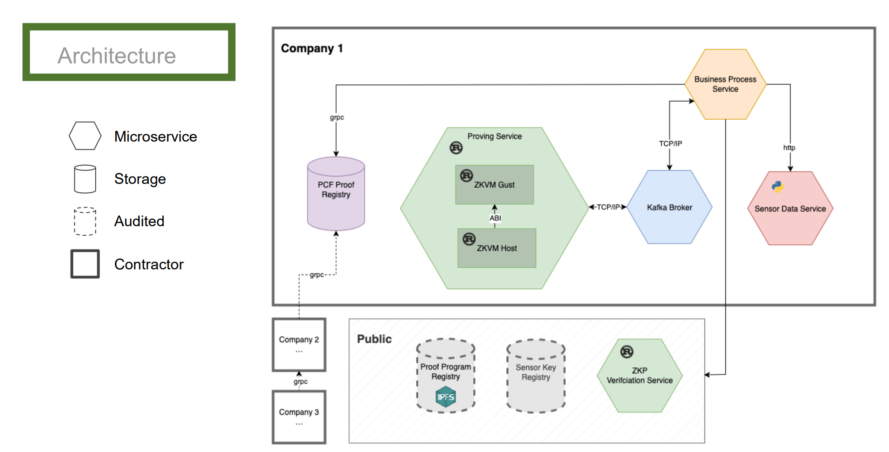

# TRACE - Trusted Real-time Assessment of Chained Emissions

TRACE addresses the critical challenge of verifiable Product Carbon Footprint (PCF) tracking in modern logistics operations and supply chains. By leveraging zero-knowledge proofs and cryptographic verification techniques, the system ensures data integrity while maintaining privacy and enabling efficient aggregation of emission data across complex transport networks.

The system implements established industry standards including **iLEAP** (Integrating Logistics Emissions and PCFs) and **GLEC** (Global Logistics Emissions Council) frameworks to ensure standardized and reliable carbon footprint calculations for logistics operations.

### Key Features
- **📊 Process-Centric Orchestration**: Camunda-based workflow management for logistics processes
- **🔐 Zero-Knowledge Proofs**: Uses RISC0 zkVM for cryptographically secure emission calculations
- **🔗 Proof Composition**: Enables chaining and aggregation of proofs across supply chain stages
- **📡 Simulated Sensor Integration**: Simulates and verifies transport data from IoT sensors for demonstration
- **🛡️ Digital Signatures**: RSA-based authentication ensures data source integrity
- **🌐 Distributed Architecture**: Microservices-based system with Kubernetes deployment

## 🏗️ System Architecture

TRACE consists of several interconnected microservices:



### Core Services

1. **[Business Process Service](https://github.com/ACP-PCVCF/camunda-service)** (Python)
   - Orchestrates workflow processes for transport carbon tracking
   - Manages BPMN workflows and task coordination
   - Integrates with all system components

2. **[Proving Service](https://github.com/ACP-PCVCF/proving-service)** (Rust/RISC0)
   - Generates zero-knowledge proofs for carbon footprint calculations
   - Verifies previous proofs and aggregates emission data
   - Implements Transport Chain Element (TCE) emission calculations

3. **[Verifier Service](https://github.com/ACP-PCVCF/verifier)** (Rust)
   - Independent verification of ZK proofs and digital signatures
   - Validates cryptographic receipts and emission claims
   - Provides gRPC API for external verification

4. **[Sensor Data Service](https://github.com/ACP-PCVCF/sensor-data-service)** (Python/FastAPI)
   - Simulates real-world vehicle sensors for demonstration
   - Generates signed sensor data with distance measurements

5. **[Sensor Key Registry](https://github.com/ACP-PCVCF/sensor-key-registry)** (Python/FastAPI)
   - Manages and validates RSA public keys for sensor authentication
   - Ensures only trusted sensors can contribute data
   - Provides REST API for key verification services

6. **[PCF Registry](https://github.com/ACP-PCVCF/pcf-registry)** (Python/Flask)
   - Stores and manages Product Carbon Footprint (PCF) proofs
   - Provides both REST and gRPC APIs for proof storage/retrieval
   - Integrates with MinIO for distributed file storage

### Emission Calculation Model

The system implements a comprehensive emission calculation model based on:
- **Transport Operations Centers (TOC)**: Road, rail, air, and sea transport modes
- **Hub Operations Centers (HOC)**: Warehousing and logistics hubs
- **Transport Chain Elements (TCE)**: Individual transport segments with mass and distance data

## 🚀 Getting Started

### Prerequisites

Ensure you have the following tools installed:
- Docker
- Kubernetes (Minikube or Kind)
- kubectl
- Helm
- Git
- Bash shell

### Quick Start

1. **Clone the repository**
   ```bash
   git clone https://github.com/ACP-PCVCF/TRACE.git
   cd TRACE
   ```

2. **Deploy the system**
   
   Choose one of the following deployment options:

   **Option A: Minikube with Helm Charts**
   ```bash
   ./scripts/minikube/setup-helm.sh
   ```

   **Option B: Kind with Helm Charts**
   ```bash
   ./scripts/kind/setup-helm.sh
   ```

3. **Access the services**
   ```bash
   # Camunda Gateway (for BPMN deployment)
   kubectl port-forward svc/camunda-zeebe-gateway 26500:26500 -n proving-system
   
   # Camunda Operate (process monitoring)
   kubectl port-forward svc/camunda-operate 8081:80 -n proving-system
   ```

For detailed setup instructions, see [Setup Documentation](docs/setup-instructions.md).

## 📖 Documentation

- **[Setup Instructions](docs/setup-instructions.md)** - Complete system setup guide
- **[Update Instructions](docs/update-instructions.md)** - Service update and maintenance procedures

## 🤝 Contributing

### This project was developed as part of an academic research initiative. The codebase demonstrates advanced concepts in:

- Zero-knowledge proof systems
- Distributed system architecture
- Cryptographic verification
- Supply chain traceability
- Privacy-preserving computation

### Project Team
- [@thangixd](https://github.com/thangixd)
- [@FR-SON](https://github.com/FR-SON)
- [@lucasstuve](https://github.com/lucasstuve)
- [@nullpunkteins](https://github.com/nullpunkteins)
- [@gretamagkekse](https://github.com/gretamagkekse)
- [@uZhW8Rgl](https://github.com/uZhW8Rgl)
- [@Arizoux](https://github.com/Arizoux)
- [@melonSorbet](https://github.com/melonSorbet)

**Supervision:** [@curiousjaki](https://github.com/curiousjaki), [@JonathanHeiss](https://github.com/JonathanHeiss)

## 📄 License

This project is licensed under the Apache License 2.0 - see the [LICENSE](LICENSE) file for details.

This project was developed as part of an academic research initiative and is open source software that can be freely used, modified, and distributed.

---